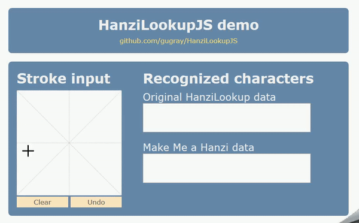

# HanziLookupJS
Free, open-source Chinese handwriting recognition in Javascript.

The library is based on Jordan Kiang's [HanziLookup] (http://kiang.org/jordan/software/hanzilookup). It contains data derived from Shaunak Kishore's [Make Me a Hanzi] (https://github.com/skishore/makemeahanzi), and an improved character recognition algorithm.

Online demo: <https://gugray.github.io/hanzilookupjs>

## Getting started
You can use the library immediately if you clone the repository and open the `index.html` file in the /demo folder in a browser. To use the library in your own application:

- Include `hanzilookup.min.js` in your page, or bundle it with your application.

- Publish at least one of the data files on your page. These files are not bundled in `hanzilookup.min.js` to avoid blocking page load. The library provides an asynchronous initialization function, which you must call before attempting to recognize characters. The callback function's first argument is `true` if the data file loaded successfully, and `false` otherwise. From the demo page:

        $(document).ready(function () {
        // Only fetch data (large, takes long) when the page has loaded
        HanziLookup.init("mmah", "../dist/mmah.json", fileLoaded);
        HanziLookup.init("orig", "../dist/orig.json", fileLoaded);
        });

- If you build your own UI for inputting strokes, then all you need is the code from the demo page's `lookup()` function:

        // Decompose character from drawing board
        var analyzedChar = new HanziLookup.AnalyzedCharacter(_drawingBoard.cloneStrokes());
        // Look up with MMAH data
        var matcherMMAH = new HanziLookup.Matcher("mmah");
        matcherMMAH.match(analyzedChar, 8, function(matches) {
          // The matches array contains results, best first
          showResults($(".mmahLookupChars"), matches);
        });

- The constructor of `AnalyzedCharacter` takes an array of strokes. Every stroke, in turn, consists of an array of points. Every point is a two-dimensional array representing its X and Y coordinates.
  
- To instantiate `Matcher` you need to pass the name you passed to the `init` function. The matcher is a fairly lightweight object, but you only need one instance throughout your page's lifetime. To look up a new character, just pass the `AnalyzedCharacter` object to its `match` function. The second argument specifies how many candidates you want to receive. The callback function returns an array of matches (best first). In each match you're interested in the `character` member.

- Character lookup is currently synchronous, but a later version of the library will add support for Web Workers and offload the computationally intensive work to a thread that doesn't block the UI. Results are returned via a callback function in anticipation of this change.

- If you choose to use `DrawingBoard` for character input, you need to incude jQuery in your page. The rest of the library has no external dependency.
  
## The two data files
 
The file `orig.json` contains the original data from Jordan Kiang's HanziLookup. In this file, character entries contain the character's stroke count, plus a flat list of substrokes, each consisting of a direction and a normalized length. 10,657 characters are encoded this way, but there are multiple entries for some to account for alternative ways of writing them, resulting in a total of 15,652 entries.
 
The file `mmah.json` is derived from Make Me a Hanzi's `graphics.txt` and encodes 9,507 characters. This file is richer because it also contains the normalized location (center point) of every substroke. The matching algorithm recognizes at runtime that this information is present and calculates the score accordingly: a substroke that is in the wrong places counts for less.

The conversion tool is a .NET Core application, included in the /mmah-convert subfolder. To repeat the conversion, you need to place `graphics.txt` from the MMAH repository in the /work subfolder.

Both files contain substroke descriptors in an `ArrayBuffer`. Each substroke is represented by 3 bytes: (1) Direction in radians, with 0\-2\*PI normalized to 0\-255; (2) Length normalized to 0\-255, where 255 is the bounding square's full width; (3) Centerpoint X and Y, both normalized to 0\-15, and X in the higher-order 4 bits.

## License

This Javascript library is derived from Jordan Kiang's original [HanziLookup](http://kiang.org/jordan/software/hanzilookup). In compliance with the original, it is licensed under [GNU LGPL](http://www.gnu.org/copyleft/gpl.html). This license covers both the code and the original data in `orig.json`.

The data in `mmah.json` is ultimately derived from the following fonts, via Make Me a Hanzi's `graphics.txt`:
- Arphic PL KaitiM GB - https://apps.ubuntu.com/cat/applications/precise/fonts-arphic-gkai00mp/
- Arphic PL UKai - https://apps.ubuntu.com/cat/applications/fonts-arphic-ukai/

You can redistribute and/or modify `mmah.json` under the terms of the Arphic Public License as published by Arphic Technology Co., Ltd. The license is reproduced in LICENSE-APL; you can also find it online at <http://ftp.gnu.org/non-gnu/chinese-fonts-truetype/LICENSE>.
